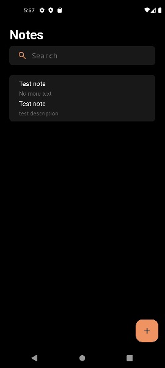
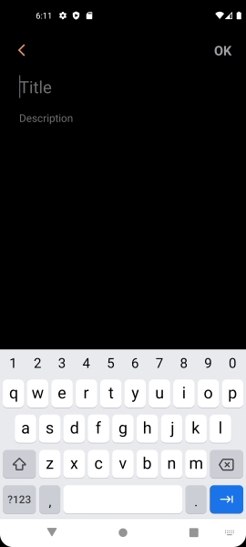

# Android Notes App
## Overview
This is a simple modern notes management application built using the latest Android development technologies and XML layouts.
This app is made to learn and practice, it is not completely finished and some aspects can be improved.
This README serves as a showcase of the app, highlighting its architecture, key features, and the libraries used.

 

## Architecture
The app follows the Model-View-ViewModel (MVVM) architecture pattern, separating the user interface (View) from the underlying data (Model) and business logic (ViewModel). Also follows the Clean Code Architecture pattern, which divides the codebase into three layers: Data, Domain, and UI. 

## Features

### Task Management

- Note List: View a list of notes, including titles and brief description.
- Note Details: Access detailed note information.
- Add New Notes: Easily add notes with titles and descriptions.
- Edit Notes: Modify notes by updating titles and descriptions.
- Delete Notes: Remove notes for a clean and organized task list.

### User Experience

- Swipe Actions: Swipe left to reveal action buttons for quick task management. You can touch or swipe right to hide action buttons.
  
  

- Search Functionality: Search for specific notes by titles or descriptions.

  
- Intuitive UI: Intuitive and visually appealing user interface for a seamless experience.

### Libraries Used
- Android Architecture Components: Utilized ViewModel and Room for robust app architecture.
- Hilt (Dagger): Enabled dependency injection for modular and maintainable code.
- Kotlin Coroutines: Facilitated asynchronous programming and background tasks.
- Navigation Component: Simplified navigation and improved user flow.
- Material Design: Followed Material Design guidelines for a modern and visually appealing UI.

## Possible improvements
- Mark notes as completed feature.
- Functional note archive button, right now only the delete button works from the Swipe Actions.
- Tags for notes and to organize them by tags
- And many more features

## License

MIT
